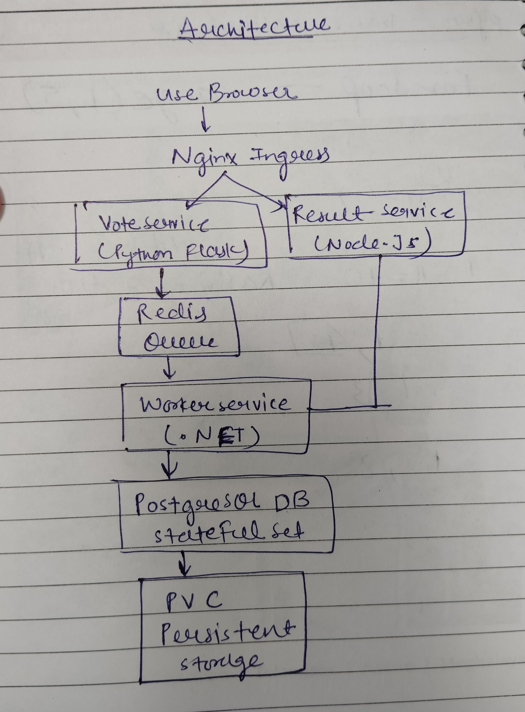

# SquareOps Assignment Submission

## Architecture Diagram

The application consists of 5 components:

- Vote Service (Python Flask)
- Redis Queue
- Worker Service (.NET)
- PostgreSQL Database
- Result Service (Node.js)

Vote service sends votes to Redis. The worker reads votes from Redis and stores them in PostgreSQL. The result service reads data from PostgreSQL and displays the live voting results.

()

---

## Changes Made

Compared to the original Kubernetes manifests, I made the following improvements:

- Added Liveness and Readiness Probes for application health monitoring.
- Added CPU and Memory Requests/Limits for all workloads.
- Moved PostgreSQL credentials to Kubernetes Secret.
- Converted PostgreSQL Deployment to StatefulSet.
- Added PersistentVolumeClaim for database persistence.
- Configured NGINX Ingress for Vote and Result applications.
- Changed Vote and Result services from NodePort to ClusterIP.
- Added GitHub Actions CI/CD pipeline for the Vote service.
- Configured Docker Hub image publishing.

---

## Local Deployment Steps

1. Enable Kubernetes in Docker Desktop.
2. Clone the repository.

```bash
git clone <https://github.com/singhruchi2004/squareops-voting-app.git>
cd squareops-voting-app
```

3. Deploy the application.

```bash
kubectl apply -f k8s-specifications/
```

4. Verify all pods are running.

```bash
kubectl get pods
```

5. Access the applications.

```bash
kubectl port-forward svc/vote 8080:8080
kubectl port-forward svc/result 8081:8081
```

Open:

- http://localhost:8080
- http://localhost:8081

---

## CI/CD Pipeline

I implemented a GitHub Actions pipeline for the Vote service.

Pipeline steps:

1. Trigger on changes inside the vote directory.
2. Build Docker image.
3. Push image to Docker Hub.
4. Fail the workflow if any step fails.

The CI/CD pipeline was implemented for the Vote service as required in the assignment.
Docker images are published to Docker Hub.

Docker Hub Repository:
#service
 worker service: https://hub.docker.com/repository/docker/ruchi14/examplevotingapp_worker/general
 Vote Service:  https://hub.docker.com/repository/docker/ruchi14/examplevotingapp_vote/general


---

## Troubleshooting

### Pods are not starting

Check pod status:

```bash

kubectl get pods

kubectl describe pod db-0
kubectl describe pod redis-79fd68dfd-bgnwh
kubectl describe pod result-77cc88b898-4gzjw
kubectl describe pod vote-56d74bcc4b-phh4k
kubectl describe pod worker-7bcf5dd6fd-srrwp


kubectl logs db-0
kubectl logs redis-79fd68dfd-bgnwh
kubectl logs result-77cc88b898-4gzjw
kubectl logs vote-56d74bcc4b-phh4k
kubectl logs worker-7bcf5dd6fd-srrwp

demo check -> kubectl logs -f worker-7bcf5dd6fd-srrwp
```

### Vote is not visible in Result application

Check worker and database logs:

```bash
kubectl logs deployment/worker
kubectl logs db-0
```

### Ingress is not working

Check ingress and services:

```bash
kubectl get ingress
kubectl get svc
```

---

## Trade-offs

- I used Docker Desktop Kubernetes for local deployment.
- I used Kubernetes manifests instead of Helm charts.
- I focused on the required CI/CD pipeline for the Vote service.
- I kept the setup simple and easy to reproduce.


## Video Walkthrough

Video Link:

(Add Loom or YouTube link here)